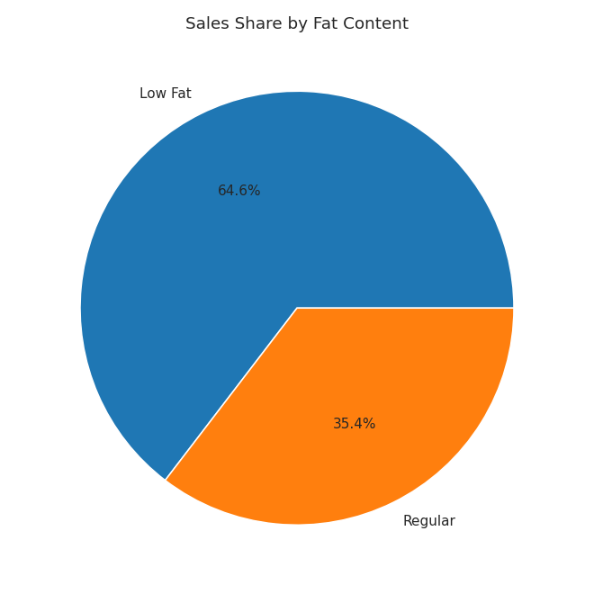
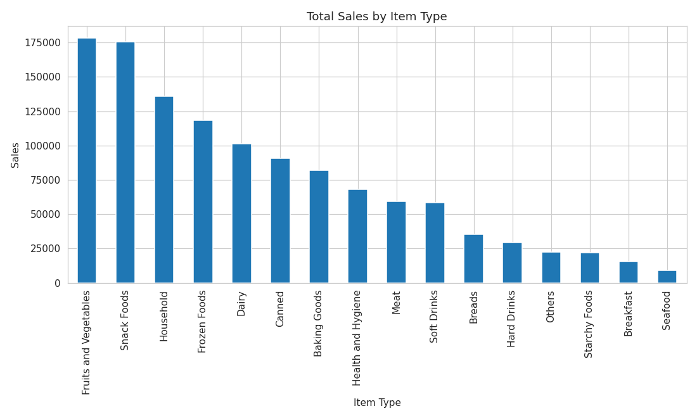
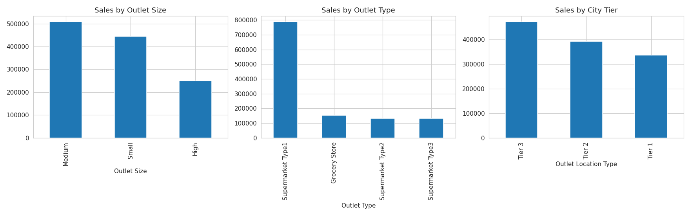
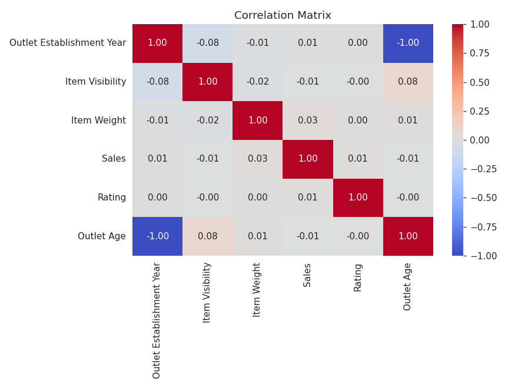

# Blinkit Grocery Sales Analysis — Python + Power BI

End-to-end analysis of 8,523 grocery sales records across 10 outlets: data cleaning and
exploratory analysis in Python, then a four-page interactive dashboard in Power BI.

**Tools:** Python (pandas, NumPy, Matplotlib, Seaborn) · Jupyter Notebook · Power BI · Excel/CSV

---

## Dashboard preview

### Executive Sales Dashboard


### Customer & Outlet Insights


---

## Business questions

1. Which product categories generate the most revenue, and where is the long tail?
2. Does the Low Fat vs Regular split in sales match what a merchandising team would assume?
3. Which outlet formats, sizes, and city tiers perform best, and should expansion follow them?
4. Does higher shelf visibility actually translate into higher sales?
5. Do customer ratings vary enough by category to be worth acting on?

## Dataset

`data/blinkit_data.csv` — 8,523 rows × 12 columns of retail/FMCG sales data covering
1,559 unique products across 10 outlets established between 1998 and 2022.

| Column | Description |
|---|---|
| Item Identifier | Unique product code |
| Item Type | Product category (16 values) |
| Item Fat Content | Low Fat / Regular |
| Item Weight | Product weight |
| Item Visibility | Share of total display area given to the product |
| Outlet Identifier | Unique store code |
| Outlet Establishment Year | Year the store opened |
| Outlet Size | Small / Medium / High |
| Outlet Location Type | Tier 1 / Tier 2 / Tier 3 city |
| Outlet Type | Grocery Store / Supermarket Type1–3 |
| Sales | Revenue for that product at that outlet |
| Rating | Average customer rating |

## Data cleaning

Four data quality problems were found and fixed in `notebooks/blinkit_analysis.ipynb`:

| Issue | Rows affected | Fix |
|---|---|---|
| `Item Fat Content` had 5 labels for 2 real categories (`Low Fat`, `low fat`, `LF`, `Regular`, `reg`) | — | Mapped to 2 canonical values |
| `Item Weight` missing | 1,463 | Imputed with the same product's mean weight across other outlets, then falling back to the category mean |
| `Item Visibility` recorded as exactly 0, which is not physically possible for a stocked item | 526 | Treated as missing, imputed with the category mean |
| No tenure field for outlets | — | Derived `Outlet Age` from `Outlet Establishment Year` |

Result: `data/blinkit_cleaned.csv`, a single analysis-ready table with zero nulls,
loaded directly into Power BI.

## Headline KPIs

| Metric | Value |
|---|---|
| Total Sales | 1.20M |
| Average Sales per item | 140.99 |
| Distinct Items | 1,559 |
| Average Rating | 3.97 |
| Average Visibility | 0.07 |

## Key findings

**1. The Low Fat / Regular split is the opposite of the usual assumption.**
Low Fat products drive 776.3K (64.6%) of revenue against 425.4K (35.4%) for Regular.
The healthier range is the primary revenue base here, not a niche.

**2. Revenue is concentrated in fresh and impulse categories.**
Fruits and Vegetables (178.1K) and Snack Foods (175.4K) lead, followed by Household (136.0K),
Frozen Foods (118.6K), and Dairy (101.3K). The bottom categories, including Seafood and Breakfast,
contribute a fraction of the top performers.

**3. One outlet format carries the business.**
Supermarket Type1 generates 787.5K, roughly 66% of total revenue and more than the other
three formats combined. Grocery Stores follow at 151.9K.

**4. Tier 3 cities outsell Tier 1.**
Tier 3 leads at 472.1K, ahead of Tier 2 (393.2K) and Tier 1 (336.4K), which argues against
concentrating expansion in metro markets. Medium outlets (507.9K) also outperform both Small
and High formats.

**5. Shelf visibility does not predict sales.**
The correlation between Item Visibility and Sales is -0.005, essentially zero. Weight (0.026)
and Rating (0.011) show no meaningful relationship either. Giving a product more display space
is not, on this data, what moves its revenue.

**6. Ratings are flat across the board.**
Average rating sits at 3.97 with very little spread by category, so ratings are not a useful
lever for differentiating product performance in this dataset.

### Recommendations

- Protect and expand the Low Fat range, since it is the revenue base rather than a secondary line.
- Prioritise Supermarket Type1 in Tier 3 cities at Medium size for new outlets, which is the
  strongest combination in the data.
- Stop using visibility as a sales lever and investigate pricing, assortment, and outlet format
  instead, since visibility shows no relationship with revenue.

## Repository structure

```
blinkit-sales-analysis/
├── data/
│   ├── blinkit_data.csv          # raw source data
│   └── blinkit_cleaned.csv       # cleaned output, input to Power BI
├── notebooks/
│   └── blinkit_analysis.ipynb    # cleaning + EDA
├── charts/                       # charts exported from the notebook
├── dashboard/                    # Power BI dashboard screenshots
├── requirements.txt
└── README.md
```

## Charts from the analysis

| | |
|---|---|
|  |  |
|  |  |

## How to run

```bash
git clone https://github.com/YOUR-USERNAME/blinkit-sales-analysis.git
cd blinkit-sales-analysis
pip install -r requirements.txt
jupyter notebook notebooks/blinkit_analysis.ipynb
```

The notebook reads `data/blinkit_data.csv` and writes `data/blinkit_cleaned.csv`.
The Power BI report is built on the cleaned file.

## Dashboard pages

| Page | Contents |
|---|---|
| Executive Sales Dashboard | KPI cards, sales by item type, fat content, outlet type, outlet size, city tier, and establishment year, with slicers on all four dimensions |
| Customer & Outlet Insights | Regular fat sales KPIs, sales per outlet, visibility vs sales and rating vs sales scatter plots, sales by outlet age |

---

**Author:** YOUR NAME · [LinkedIn](https://linkedin.com/in/YOUR-PROFILE) · [Email](mailto:YOUR-EMAIL)
